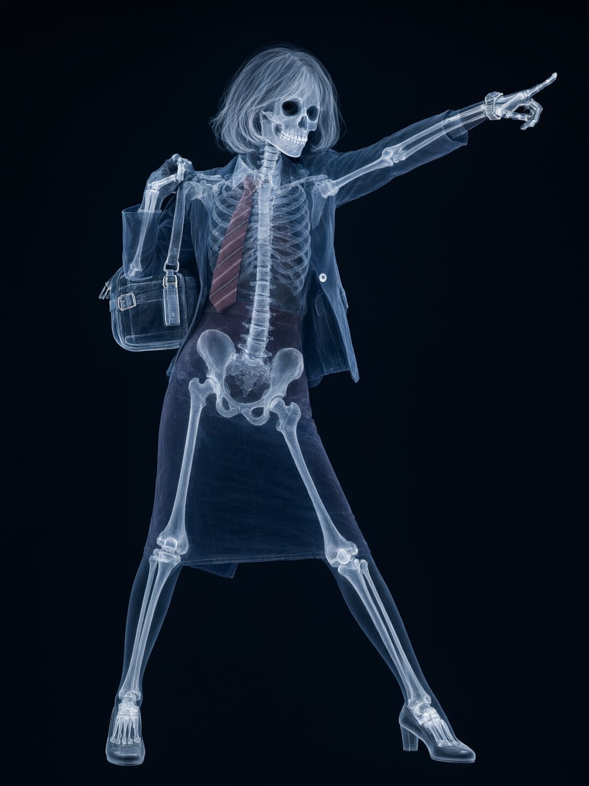
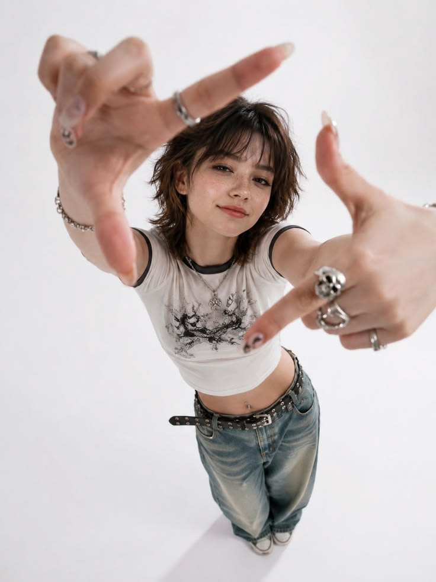
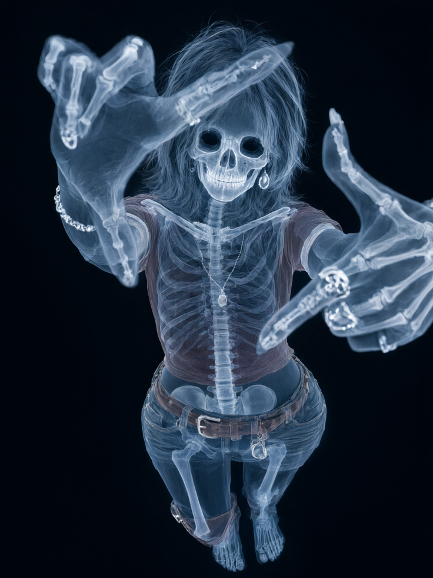

# X-Ray-anything

把任意图片变成 X 光风格。不是专业医疗用途——纯风格化。

一张随手拍，变成一张像刚从 X 光机里出来的片子：经典医用蓝白、近白骨骼、半透明衣物、纯黑背景。

## 效果展示

| 原图 | X 光效果 |
|------|---------|
|  |  |
|  |  |

## 核心特点

- **近白骨骼**：骨骼是画面里最亮的元素，接近纯白、带一丝蓝
- **蓝白两色**：整体蓝白冷调，衣物保留原色相（降饱和）
- **半透明衣物**：衣服是半透明色膜，能透出下面的骨骼
- **保留构图**：原图的姿态、构图、主体身份完整保留
- **参考图锚定**：内置骨骼/衣物参考图，消除文字歧义，稳定生成

## 安装

```bash
git clone https://github.com/9439426xx-design/x-ray-anything-skill.git
mkdir -p ~/.codex/skills
cp -R x-ray-anything-skill/skills/x-ray-anything ~/.codex/skills/
```

如果 Skill 没有立即出现，重启 Codex。

## 使用

1. 上传一张图片
2. 调用 `$x-ray-anything`
3. 可选：附加「去背景」指令（去掉背景，纯黑底）

## 参考图

`skills/x-ray-anything/assets/` 内置两张参考图，生图时和原图一起传给模型，让模型「照参考图的质感，套原图的发型和款式」。

| 文件 | 用途 |
|------|------|
| `bone-reference.png` | 目标骨骼+头发+整体质感 |
| `cloth-reference.png` | 目标衣物质感 |

## 仓库结构

```text
x-ray-anything-skill/
├── README.md
├── LICENSE                         # MIT
├── skills/
│   └── x-ray-anything/
│       ├── SKILL.md                 # 核心指令
│       ├── agents/openai.yaml       # 多平台适配
│       └── assets/                  # 参考图
│           ├── bone-reference.png
│           └── cloth-reference.png
└── examples/                        # before/after 作品档案
    ├── case-1-fullbody/
    └── case-2-overhead/
```

## License

[MIT](./LICENSE)
